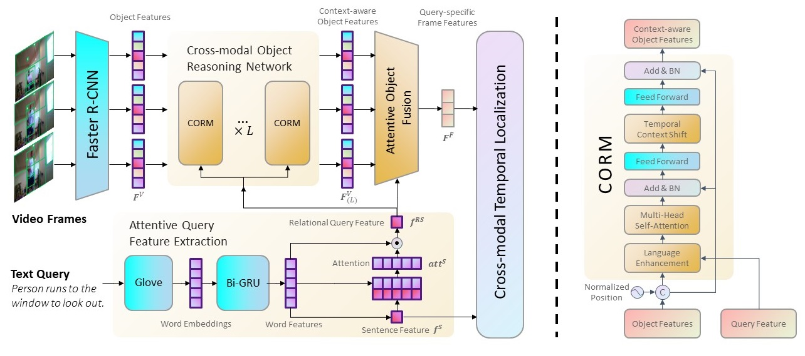
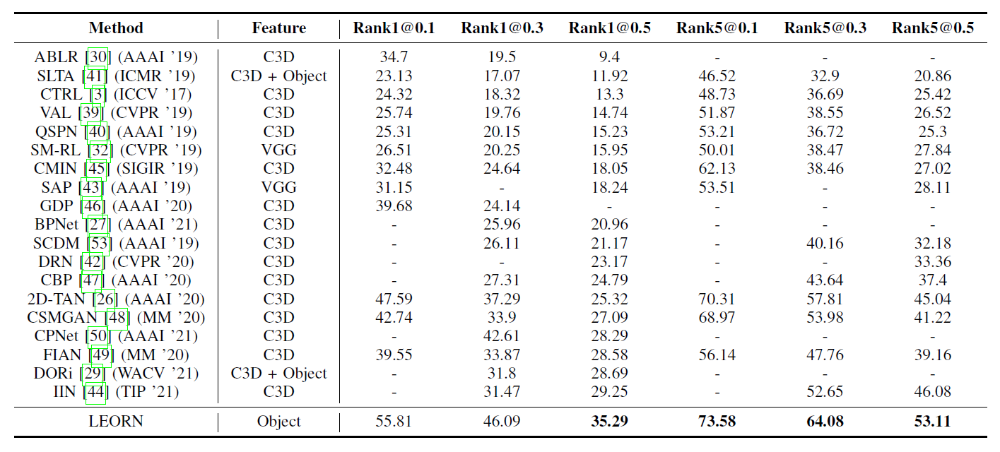
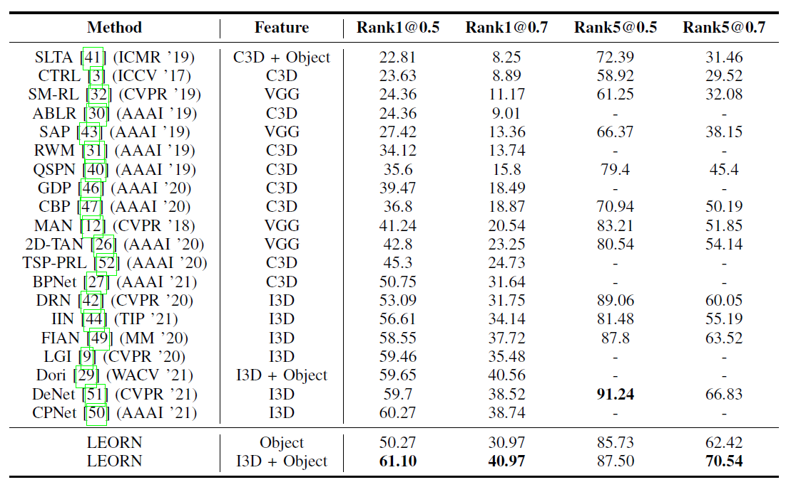
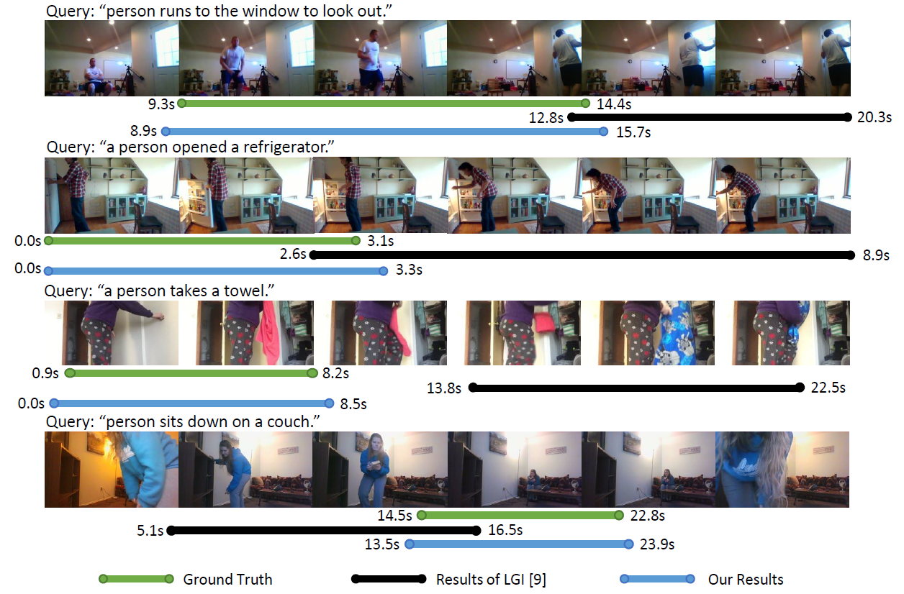

# Language-enhanced Object Reasoning Networks for Video Moment Retrieval with Text Query

## Introduction

This is the implementation code and instruction of the proposed work  *"Language-enhanced Object Reasoning Networks for Video Moment Retrieval with Text Query"* (LEORN).

## Environment Requirements

Our code runs based on the following dependencies:
- python3
- torch
- numpy
- tqdm
- h5py
- argparse
- tensorboard
- easydict
- torchtext
- terminaltables
  
## Training 

### Datasets Preparation
The datasets we used for training and evaluation are listed as follow:

- TACoS: https://www.mpi-inf.mpg.de/departments/computer-vision-and-machine-learning/research/vision-and-language/tacos-multi-level-corpus
- Charades-STA: https://prior.allenai.org/projects/charades

### Running
Using the following command to train and evaluate our model.


TACoS
```
python -m torch.distributed.launch --nproc_per_node=2 moment_localization/train_muti.py --gpus 0,1 --cfg experiments\tacos\LEORN-128x128-K5L8.yaml --verbose
```

Charades-STA 
```
python -m torch.distributed.launch --nproc_per_node=2 moment_localization/train_muti.py --gpus 0,1 --cfg experiments/charades/LEORN-64x64-K9L4.yaml --verbose
```

## Main Idea
We propose a novel Language-enhanced Object Reasoning Networks (LEORN) for video moment retrieval with text query, as shown in the figure below.

1. The proposed LEORN uses the object features extracted by the object detection network and incorporates the language features to model the relation between the objects within the frame. 
2. Besides, we design a temporal context shift mechanism to model the temporal relationship of objects while reducing the noise from irrelevant objects in the adjacent frames. 
3. Furthermore, as a general video understanding networks for object-level features, the proposed LEORN shows great potential on migrating to other cross-modal video understanding tasks.

<div align="center">

</div>

### Insight of Our Work

1. We propose a novel model termed Language-enhanced Object Reasoning Networks (LEORN) for video moment retrieval, which leverages object-level features for cross-modal object reasoning. The fully-reasoned features contain abundant implicit information with good compatibility so as to better understand the video content.
2. We design an attentive feature query extraction mechanism to extract relational query feature which is more consistent with the object reasoning process.
3. We conduct extensive experiments on two public datasets: TACoS and Charades-STA. The experimental results show that our proposed method with object-level features can achieve competitive results and the model in a comparable experimental setting outperforms other state-of-the-art approaches that demonstrate the effectiveness of our proposed method with object features.
4. Our proposed LEORN shows great potential on migrating to other cross-modal video understanding tasks.

## Overall Results

### Results on TACoS Dataset
<div align="center">

</div>

### Results on Charades-STA Dataset
<div align="center">

</div>

### Visualization of Video Moment Retrieval
<div align="center">

</div>